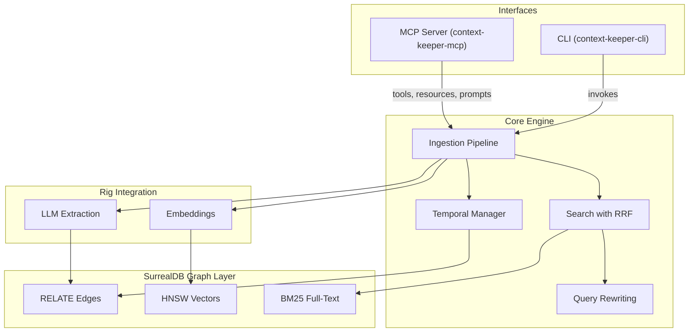

# Context Keeper

Temporal knowledge graph memory for AI agents. Give Claude, Cursor, or any MCP-compatible assistant a persistent memory that tracks entities, relationships, and changes over time — no API key required to get started.

> **Privacy- and security-conscious?** All pre-built binaries are built on public GitHub Actions and shipped with SHA-256 checksums. The `npx` wrapper verifies the binary hash before executing. See [Security & integrity](#security--integrity) for details and manual verification steps.

## Demo

See temporal reasoning in action — no API key or Docker required:

```bash
cargo run --example temporal_demo -p context-keeper-cli
```

<!-- asciinema player (uncomment once cast file is uploaded):
[](https://asciinema.org/a/PLACEHOLDER)
-->

The demo ingests Alice and Bob at Acme Corp, updates Alice's job to BigCo, then shows that searches reflect the change while historical snapshots preserve the original state. Run with `-- --output results.json` to save latency metrics to a file.

## Quickstart: MCP Server (Claude Desktop / Cursor)

**1. Install**

Build from source:

```bash
git clone https://github.com/mindbend0x/context-keeper.git
cd context-keeper
cargo build --release -p context-keeper-mcp
cp target/release/context-keeper-mcp ~/.cargo/bin/
```

Or download a pre-built binary from [GitHub Releases](https://github.com/mindbend0x/context-keeper/releases).

**2. Configure your client**

<details>
<summary><b>Claude Desktop</b></summary>

Add to `~/Library/Application Support/Claude/claude_desktop_config.json`:

```json
{
  "mcpServers": {
    "context-keeper": {
      "command": "npx",
      "args": ["context-keeper-mcp"]
    }
  }
}
```

</details>

<details>
<summary><b>Cursor</b></summary>

Add to `.cursor/mcp.json` in your project (or global settings):

```json
{
  "mcpServers": {
    "context-keeper": {
      "command": "npx",
      "args": ["context-keeper-mcp"]
    }
  }
}
```

</details>

**3. Try it**

Restart your client, then tell your assistant:

> "Remember that Alice is a software engineer at Acme Corp and Bob is her manager."

Then ask:

> "What do you know about Alice?"

That's it. The MCP server uses mock extraction by default (no API key needed). Entities are extracted from capitalized words, and memories are stored in an in-memory graph. To upgrade to real LLM-powered extraction, see [Using Real LLM Extraction](#using-real-llm-extraction) below.

## Quickstart: CLI

**Via Homebrew (macOS / Linux)**

```bash
brew install mindbend0x/context-keeper/context-keeper
```

**From Source**

```bash
git clone https://github.com/mindbend0x/context-keeper.git
cd context-keeper
cargo build --release -p context-keeper-cli
cp target/release/context-keeper ~/.cargo/bin/
```

```bash
# Add a memory (works immediately, no config needed)
context-keeper add --text "Alice is a software engineer at Acme Corp"

# Search
context-keeper search --query "Acme"

# Look up an entity
context-keeper entity --name "Alice"

# List recent memories
context-keeper recent --limit 5
```

Without LLM config, the CLI uses the same mock extraction as the MCP server.

## MCP Tools

| Tool | Description |
|------|-------------|
| `add_memory` | Ingest text into the graph — extracts entities/relations, generates embeddings |
| `search_memory` | Hybrid vector + BM25 keyword search with RRF fusion |
| `expand_search` | Query expansion for improved recall |
| `get_entity` | Fetch entity details with full relationship graph |
| `snapshot` | Point-in-time snapshot of the knowledge graph |
| `list_recent` | List the N most recent memories |

## MCP Resources

The server also exposes **browsable resources** that MCP clients can read directly:

| Resource URI | Description |
|---|---|
| `memory://recent` | The 20 most recently added memories (JSON) |
| `memory://entity/{name}` | Detailed entity info including relationships |

All active entities are listed as individual resources, so clients with resource support (e.g. Claude Desktop) can browse the knowledge graph without calling tools.

## MCP Prompts

Pre-built prompt templates that guide the assistant through multi-step workflows:

| Prompt | Arguments | What it does |
|---|---|---|
| `summarize-topic` | `topic` | Searches the graph and produces a comprehensive summary of a topic |
| `what-changed` | `since` (ISO 8601) | Compares a point-in-time snapshot with current state to describe changes |
| `add-context` | `context` | Ingests conversation context and confirms extracted entities/relations |

## Transports

The MCP server supports two transport modes:

| | stdio | Streamable HTTP |
|---|---|---|
| Command | `context-keeper-mcp` (default) | `context-keeper-mcp --transport http` |
| Best for | Local, single-client (Claude Desktop, Cursor) | Multi-client, remote, Docker |
| Latency | Lowest (direct pipe) | Slightly higher (HTTP overhead) |
| Process lifecycle | Managed by the MCP client | Self-managed (systemd, Docker, etc.) |

HTTP mode serves at `http://localhost:3000/mcp` by default (configurable via `--http-port` or `MCP_HTTP_PORT`).

## Integrations

Ready-made setup for popular MCP clients:

- **Claude Code** — Plugin with skills and MCP server registration. See [`plugins/claude/`](plugins/claude/).
- **Claude Desktop** — One-command installer with stdio/HTTP support. See [`plugins/claude-desktop/`](plugins/claude-desktop/).
- **Cursor / VS Code** — Extension with sidebar panel, search command, and add-from-selection. See [`plugins/cursor/`](plugins/cursor/).
- **Obsidian** — Config template at [`configs/obsidian-mcp.json`](configs/obsidian-mcp.json).

All integrations share the same `~/.context-keeper/data` RocksDB store by default, so memories are available across every client.

Example config templates for quick manual setup live in [`configs/`](configs/). For developers working from a clone, [`configs/claude-dev.json`](configs/claude-dev.json) runs `cargo run` directly without a pre-built binary.

**Quick config for any client:**

```bash
# Claude Desktop (default)
./scripts/configure-mcp.sh --api-url https://api.openai.com/v1 --api-key sk-...

# Cursor
./scripts/configure-mcp.sh --target cursor --api-url https://api.openai.com/v1 --api-key sk-...

# Claude Code
./scripts/configure-mcp.sh --target claude-code
```

## Using Real LLM Extraction

Set these environment variables (or create a `.env` file — see [`.env.example`](.env.example)):

```bash
export OPENAI_API_URL=https://api.openai.com/v1
export OPENAI_API_KEY=sk-...
export EMBEDDING_MODEL=text-embedding-3-small
export EXTRACTION_MODEL=gpt-4o-mini
```

Any OpenAI-compatible endpoint works. When all four variables are set, both the CLI and MCP server switch from mock extraction to real LLM-powered entity/relation extraction with vector embeddings.

For the MCP server, you can pass these as environment variables in your client config:

```json
{
  "mcpServers": {
    "context-keeper": {
      "command": "npx",
      "args": ["context-keeper-mcp"],
      "env": {
        "OPENAI_API_URL": "https://api.openai.com/v1",
        "OPENAI_API_KEY": "sk-...",
        "EMBEDDING_MODEL": "text-embedding-3-small",
        "EXTRACTION_MODEL": "gpt-4o-mini"
      }
    }
  }
}
```

## Storage Backends

By default, all Context Keeper binaries use **RocksDB at `~/.context-keeper/data`**. This means every tool (Claude Desktop, Cursor, CLI) shares the same knowledge graph automatically.

```bash
# Default — RocksDB at ~/.context-keeper/data (shared across all tools)
context-keeper add --text "..."

# Custom RocksDB path
context-keeper --storage rocksdb:./my_data add --text "..."

# In-memory (ephemeral — exports to context.sql on exit, reimports on start)
context-keeper --storage memory add --text "..."
```

## How It Works

Context Keeper is a Rust implementation inspired by [Graphiti](https://www.presidio.com/technical-blog/graphiti-giving-ai-a-real-memory-a-story-of-temporal-knowledge-graphs/), replacing Python/Neo4j with Rust, [Rig](https://rig.rs), and [SurrealDB](https://surrealdb.com).

It ingests text episodes, extracts entities and relationships (via LLM or mock heuristics), and stores them in a SurrealDB-backed graph with:

- **HNSW vector search** on entity and memory embeddings
- **BM25 full-text search** across entities, memories, and episodes
- **Hybrid RRF fusion** combining vector similarity and keyword relevance
- **Temporal versioning** — every entity and relation carries `valid_from`/`valid_until` timestamps with point-in-time snapshot queries
- **True UPSERT** — entities are deduplicated by name with summary/embedding merging

## Architecture

See [`docs/internal/architecture.md`](docs/internal/architecture.md) for the full crate dependency graph and MCP server internals.



### Workspace Structure

```
context-keeper/
├── crates/
│   ├── context-keeper-core/      # Models, ingestion pipeline, search, temporal manager
│   ├── context-keeper-rig/       # Rig integration: embeddings, entity/relation extraction
│   ├── context-keeper-surreal/   # SurrealDB client, schema, repository, vector store
│   ├── context-keeper-mcp/       # MCP server binary (stdio transport)
│   └── context-keeper-cli/       # CLI binary + examples
├── migrations/                   # Reference SurrealQL schema
└── Cargo.toml                    # Workspace root
```

### Data Model

| Table | Type | Purpose |
|-------|------|---------|
| `episode` | Node | Raw text input with source and timestamp |
| `entity` | Node | Extracted entities with embeddings and temporal bounds |
| `memory` | Node | Searchable memory chunks with embeddings |
| `relates_to` | Edge (entity -> entity) | Typed relationships with confidence scores |
| `sourced_from` | Edge (memory -> episode) | Links memories to source episodes |
| `references` | Edge (memory -> entity) | Links memories to mentioned entities |

## CLI Reference

```
context-keeper [OPTIONS] <COMMAND>

Commands:
  add      Add a memory from text input
  search   Search memories (hybrid vector + keyword)
  entity   Get entity details by name
  recent   List recent memories

Global Options:
  -e, --embedding-model-name   Embedding model name    [env: EMBEDDING_MODEL]
  -d, --embedding-dims         Embedding dimensions    [env: EMBEDDING_DIMS]
  -x, --extraction-model-name  Extraction model name   [env: EXTRACTION_MODEL]
  -u, --api-url                OpenAI-compatible URL   [env: OPENAI_API_URL]
  -k, --api-key                API key                 [env: OPENAI_API_KEY]
  -f, --db-file-path           DB export file path     [env: DB_FILE_PATH]     [default: context.sql]
      --storage                Storage backend         [env: STORAGE_BACKEND]  [default: rocksdb:~/.context-keeper/data]
```

## Docker

```bash
export OPENAI_API_KEY=sk-...
docker compose up --build
```

The MCP server will be available on `http://localhost:3000` with RocksDB persistence via a Docker volume.

## Running Tests

```bash
cargo test --workspace
```

## MCP Reference

For the full MCP tool/resource/prompt reference with parameters and examples, see [`docs/internal/mcp.md`](docs/internal/mcp.md).

## Key Dependencies

| Crate | Purpose |
|-------|---------|
| `surrealdb` | Graph database with HNSW + BM25 |
| `rig-core` | LLM completions + embeddings |
| `rmcp` | Rust MCP SDK (stdio + streamable HTTP transports) |
| `tokio` | Async runtime |
| `clap` | CLI argument parsing |
| `axum` | HTTP server for streamable HTTP transport |

## Security & integrity

Context Keeper ships pre-built binaries through [GitHub Releases](https://github.com/mindbend0x/context-keeper/releases), the `npx context-keeper-mcp` wrapper, and a Homebrew tap. Every binary is covered by a SHA-256 checksum that is published alongside the release and enforced at install/exec time.

**How binaries are built.** Release binaries are produced exclusively by the public [release workflow](.github/workflows/release.yml) running on GitHub-hosted runners. The workflow is triggered by a `v*` tag push, builds each target (`x86_64`/`aarch64` × `linux`/`darwin`) from the tagged source, and uploads the resulting artifacts to the GitHub Release. The build log is public and immutable.

**How checksums are produced.** For every released binary the workflow writes:

- a per-binary `.sha256` sidecar (e.g. `context-keeper-mcp-x86_64-apple-darwin.sha256`), and
- a combined `SHA256SUMS` manifest at the release level that lists every artifact.

The main `context-keeper-mcp` npm package additionally ships a `SHA256SUMS` manifest keyed by platform tag (`darwin-arm64`, `darwin-x64`, `linux-arm64`, `linux-x64`). The Homebrew formula pins each binary's SHA-256 inline per Homebrew convention.

**How verification happens automatically.**

- **npx / npm** — The wrapper (`npm/context-keeper-mcp/bin/run.js`) re-hashes the resolved platform binary on every invocation and compares against the shipped `SHA256SUMS` entry. On mismatch — or if the manifest is missing, or has no entry for the platform — the wrapper **fails hard** with the expected and actual hashes logged, and does **not** execute the binary.
- **Homebrew** — Homebrew itself enforces the `sha256` pinned in the formula; a tampered download is rejected before `brew install` finishes.

**Manually verifying a download.**

```bash
# 1. Download the binary and its sidecar from the release page.
curl -LO https://github.com/mindbend0x/context-keeper/releases/download/vX.Y.Z/context-keeper-mcp-aarch64-apple-darwin
curl -LO https://github.com/mindbend0x/context-keeper/releases/download/vX.Y.Z/context-keeper-mcp-aarch64-apple-darwin.sha256

# 2. Verify the sidecar (one-binary check).
shasum -a 256 -c context-keeper-mcp-aarch64-apple-darwin.sha256   # macOS
sha256sum   -c context-keeper-mcp-aarch64-apple-darwin.sha256     # Linux

# 3. Or verify the entire release against the combined manifest.
curl -LO https://github.com/mindbend0x/context-keeper/releases/download/vX.Y.Z/SHA256SUMS
sha256sum -c SHA256SUMS --ignore-missing
```

Both should print `OK` for each file. Any other output means the binary does not match the published release and must not be trusted.

**Future work (out of scope for now).**

- **Sigstore / cosign signatures.** Keyless signing with GitHub OIDC identities would let users verify not just the hash but also the provenance of each artifact. Tracked for a follow-up release.
- **Reproducible builds.** Bit-for-bit reproducibility (deterministic Rust builds with pinned toolchain, `SOURCE_DATE_EPOCH`, stripped timestamps) would let third parties rebuild and confirm the published hash. A longer-term goal.

## License

MIT
