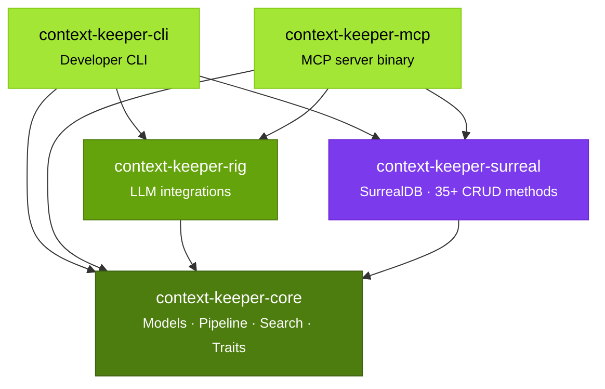

import ArchitectureDiagram from '@site/src/components/ArchitectureDiagram';

## Overview

Context Keeper is a five-crate Rust workspace designed with trait-based decoupling for modularity and testability. The **core** crate owns pure logic and trait definitions, **rig** implements LLM integrations, **surreal** handles storage, and **mcp** and **cli** are thin binaries that orchestrate the components.

## Crate Dependency Graph



### Interactive view

Hover over any crate to highlight its dependencies:

<ArchitectureDiagram />

## Crate Roles

### context-keeper-core

Pure logic with zero heavyweight dependencies. Contains:
- **Data Models** — Episode, Entity, Memory, Relation, IngestionResult, SearchResult
- **Ingestion Pipeline** — Episode creation, entity/relation extraction coordination, embedding generation, and persistence orchestration
- **Search Engine** — Hybrid search combining HNSW vector search with BM25 keyword search, fused via Reciprocal Rank Fusion (K=60)
- **Temporal Management** — Point-in-time queries using valid_from/valid_until timestamps
- **Query Expansion** — Analyze original query and generate semantic variants
- **Trait Definitions** — Embedder, EntityExtractor, RelationExtractor, QueryRewriter (implementations provided by rig)

### context-keeper-rig

Rig framework integration for LLM-powered features:
- **RigEmbedder** — Generates vector embeddings using OpenAI-compatible endpoints (e.g., text-embedding-3-small)
- **RigEntityExtractor** — LLM-powered entity extraction with structured output
- **RigRelationExtractor** — LLM-powered relation extraction with confidence scoring
- **RigQueryRewriter** — Generates search query variants for expanded search

All integrations use OpenAI-compatible endpoints, configurable via environment variables.

### context-keeper-surreal

SurrealDB client and repository layer:
- **Schema Management** — Tables for entities, relations, memories, episodes, and vector indexes
- **Repository** — 35+ CRUD methods for all entity types
- **Vector Search** — HNSW index for semantic similarity
- **Keyword Search** — BM25 full-text indexing and search
- **Graph Traversal** — Follow relations to find connected entities
- **Temporal Queries** — Filter by valid_from/valid_until timestamps for point-in-time state
- **Soft Deletes** — Mark inactive records rather than deleting

Supports multiple backends: RocksDB (default, `~/.context-keeper/data`), in-memory, and remote.

### context-keeper-mcp

MCP server binary exposing Context Keeper as agent tools via the MCP protocol:
- **10 Tools** — add_memory, search_memory, expand_search, get_entity, snapshot, list_recent, list_agents, list_namespaces, agent_activity, cross_namespace_search
- **Browsable Resources** — Entities, relations, and memories as rich resources
- **3 Prompt Templates** — Topic summaries, change diffs, and context ingestion
- **Transport Support** — stdio (default) and HTTP (via axum)

Uses rmcp (Rust MCP SDK) for protocol compliance.

### context-keeper-cli

Developer CLI for direct interaction:
- **add** — Create new episodes and memories
- **search** — Query the knowledge graph
- **entity** — View entity details and relations
- **recent** — List recent memories

Useful for scripting and manual testing.

## Data Flow

### Ingestion

1. Episode creation with source context and optional metadata
2. Entity extraction via LLM (RigEntityExtractor)
3. Relation extraction via LLM (RigRelationExtractor)
4. Embedding generation for all new entities and relations (RigEmbedder)
5. Persistence:
   - UPSERT entities (composite key: name + type + namespace)
   - Create new relations, merge confidence for duplicates
   - Store memories linking episode to entities and relations

### Search

1. Embed user query via RigEmbedder
2. Vector search on HNSW index (top-K nearest neighbors)
3. Keyword search on BM25 index (top-K by relevance)
4. Fuse results using Reciprocal Rank Fusion (K=60) to produce ranked list
5. Enrich with entity details, relation context, and temporal validity

### Expanded Search

1. Original query analyzed by RigQueryRewriter
2. LLM generates 3 semantic variants (rephrases, synonym substitution, etc.)
3. Run hybrid search on all 4 queries (original + 3 variants)
4. Collect all results and re-fuse with RRF
5. Higher diversity and recall; slight latency increase

### Temporal Queries

1. Parse timestamp or time range from search request
2. Filter entities by valid_from/valid_until (only active at that time)
3. Filter relations by valid_from/valid_until
4. Return point-in-time state of the knowledge graph

## Key Design Decisions

### Trait-Based Decoupling

The core crate defines abstract traits that form the extension points of the system. Implementations live in the rig crate, allowing:
- **Testability** — Mock implementations for unit tests (no API keys needed)
- **Modularity** — Swap implementations without touching core logic
- **Future Extensibility** — Add local embedders, custom LLM models, etc.

#### Core trait signatures

These traits are defined in `context-keeper-core/src/traits.rs`:

```rust
/// Generates embedding vectors for text.
#[async_trait]
pub trait Embedder: Send + Sync {
    async fn embed(&self, text: &str) -> Result<Vec<f64>>;
    async fn embed_batch(&self, texts: &[String]) -> Result<Vec<Vec<f64>>>;
}

/// Extracts named entities from raw text.
#[async_trait]
pub trait EntityExtractor: Send + Sync {
    async fn extract_entities(&self, text: &str) -> Result<Vec<ExtractedEntity>>;
}

/// Extracts relations between entities from raw text.
#[async_trait]
pub trait RelationExtractor: Send + Sync {
    async fn extract_relations(
        &self,
        text: &str,
        entities: &[ExtractedEntity],
    ) -> Result<Vec<ExtractedRelation>>;
}

/// Rewrites a search query into semantic variants for expanded recall.
#[async_trait]
pub trait QueryRewriter: Send + Sync {
    async fn rewrite(&self, query: &str) -> Result<Vec<String>>;
}
```

All traits are `Send + Sync` and async, allowing them to be shared across threads via `Arc<dyn Trait>`.

#### Implementing a custom embedder

To add a custom embedding provider (e.g., a local model via Ollama):

1. Create a new crate that depends on `context-keeper-core`:
   ```toml
   [dependencies]
   context-keeper-core = { path = "../context-keeper-core" }
   async-trait = "0.1"
   ```

2. Implement the `Embedder` trait:
   ```rust
   use context_keeper_core::traits::Embedder;

   pub struct OllamaEmbedder {
       endpoint: String,
       model: String,
   }

   #[async_trait]
   impl Embedder for OllamaEmbedder {
       async fn embed(&self, text: &str) -> Result<Vec<f64>> {
           // Call your embedding API here
       }
   }
   ```

3. Pass it to the pipeline in your binary:
   ```rust
   let embedder: Arc<dyn Embedder> = Arc::new(OllamaEmbedder::new(...));
   let pipeline = IngestionPipeline::new(embedder, extractor, ...);
   ```

#### Dependency injection pattern

The CLI and MCP binaries construct the pipeline by instantiating concrete implementations and passing them as trait objects:

```rust
// In context-keeper-mcp/src/main.rs (simplified)
let embedder: Arc<dyn Embedder> = Arc::new(RigEmbedder::new(config));
let entity_extractor: Arc<dyn EntityExtractor> = Arc::new(RigEntityExtractor::new(config));
let relation_extractor: Arc<dyn RelationExtractor> = Arc::new(RigRelationExtractor::new(config));
let query_rewriter: Arc<dyn QueryRewriter> = Arc::new(RigQueryRewriter::new(config));
let repository = Arc::new(SurrealRepository::new(db).await?);

let pipeline = IngestionPipeline::new(embedder, entity_extractor, relation_extractor, repository);
let search = SearchEngine::new(repository, query_rewriter);
```

In tests, the same pipeline is constructed with mock implementations — no API keys, no network, instant execution:

```rust
let embedder = Arc::new(MockEmbedder::new(1536));
let extractor = Arc::new(MockEntityExtractor::new());
// ... same pipeline construction
```

### SurrealDB as Single Engine

Rather than coordinating multiple databases (vector store, relational DB, full-text index), all operations target a single SurrealDB instance:
- Entities stored as documents with vector embeddings
- Relations as edges in the graph
- Full-text search via BM25 indexes
- Point-in-time queries via temporal fields
- No synchronization complexity

### Soft Deletes

Records are never deleted; instead, `valid_from` and `valid_until` timestamps mark their lifecycle:
- Entities become invalid when contradicted or superseded
- Relations fade as confidence decays
- Audit trail available via SurrealDB changefeeds
- Point-in-time state queries work naturally

### Mock Implementations

The full test suite runs without API keys:
- `MockEmbedder` returns deterministic vectors based on text hash
- `MockEntityExtractor` parses simple syntax (e.g., "Alice is a person")
- `MockRelationExtractor` handles basic patterns
- No network calls, instant execution

### Pure Ingestion Pipeline

The core ingestion pipeline is pure logic:
- Takes trait objects (embedder, extractors) and episode data
- Returns `IngestionResult` containing extracted entities, relations, and embeddings
- Caller (MCP server, CLI, or tests) decides persistence, retries, and error handling
- Easier to test, easier to compose with different storage backends

### Namespace Support

Memories, entities, and searches can be scoped to namespaces:
- Multi-tenant isolation (different users, organizations)
- Multi-project isolation within a single workspace
- Reduces cross-contamination in shared instances
