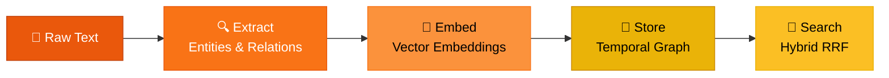
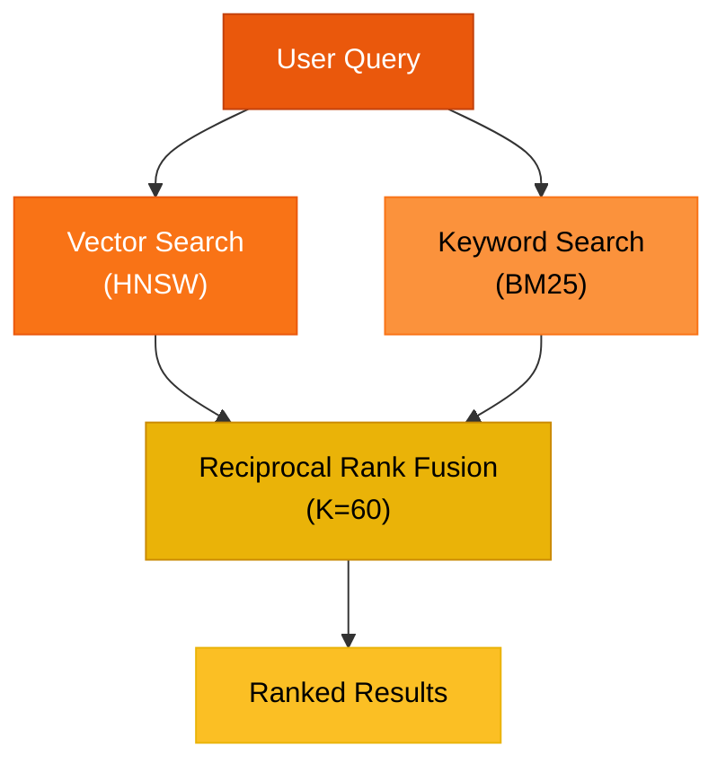

# How It Works

Context Keeper turns unstructured text into a temporal knowledge graph. This guide explains the core mechanisms: the ingestion pipeline, hybrid search, and temporal tracking.

## Overview

Every piece of information you add to Context Keeper flows through an **ingestion pipeline**, then becomes queryable via **hybrid search**:



The result is a living, time-aware knowledge base that your agent can query to recall and reason about past interactions.

## Ingestion Pipeline

When you call `add` or `search` (which also ingests context), here's what happens:

### Step 1: Episode Creation

An **episode** is the base unit of input:
- Raw text content
- Source identifier (e.g., "chat", "email", "document")
- Timestamp (defaults to now)

### Step 2: Entity Extraction

The system identifies key entities (people, organizations, concepts) in the text.

**In LLM mode:** A language model reads the text and outputs structured JSON with entities (name, type, summary).

**In mock mode:** The system uses simple heuristics—capitalized words are marked as entities, their type is inferred from context, and summaries are extracted.

Example:
```
Input: "Alice and Bob founded TechCorp in 2020."
Extracted entities:
  - Alice (type: person)
  - Bob (type: person)
  - TechCorp (type: organization)
```

### Step 3: Relation Extraction

After entities are identified, the system finds relationships between them.

**In LLM mode:** The model outputs structured JSON with relations (from entity, to entity, relation type, confidence).

**In mock mode:** Simple patterns like "X founded Y" or "X works at Y" are recognized.

Example:
```
Relations:
  - Alice --founded--> TechCorp
  - Bob --founded--> TechCorp
```

### Step 4: Embedding Generation

Each entity and the full episode text are embedded using a semantic embedding model (e.g., `text-embedding-3-small`). These embeddings enable vector similarity search.

### Step 5: Persistence & Entity Upsert

Entities are stored with deduplication:
- If an entity with the same name already exists, its summary is **merged** with the new information
- If new information contradicts old data, the old entity is **invalidated** (soft delete via `valid_until`)
- Relations between entities are created or updated
- The raw memory chunk is linked to the episode

### Step 6: Diff Returned

The pipeline returns a diff showing:
- Entities created, updated, or invalidated
- Relations added or changed
- Conflicts or contradictions detected

## Hybrid Search

Context Keeper uses a dual-search strategy to balance semantic and lexical relevance:



### Vector Search (HNSW)

Embeddings are indexed in an HNSW (Hierarchical Navigable Small World) vector index. When you query:

1. Your query is embedded using the same model as the corpus
2. Nearest neighbors are retrieved via approximate nearest neighbor search
3. Results are ranked by cosine similarity

This captures semantic meaning: "CEO" is similar to "chief executive".

### Keyword Search (BM25)

In parallel, the full episode text and entity summaries are indexed with BM25 (probabilistic relevance). This captures exact term matching: "CEO" must literally appear.

### Reciprocal Rank Fusion (K=60)

The two ranked lists are merged via RRF. Each result in the vector list gets a score `1 / (60 + rank)`, same for keywords, then scores are summed. This balances semantic and lexical relevance without requiring a manual weight.

Example:
```
Query: "Who leads engineering?"

Vector search returns:
  1. Entity "Alice" (summary: "Head of Engineering") — score 0.95
  2. Relation "leads" — score 0.85

Keyword search returns:
  1. Relation "leads engineering team" — exact match
  2. Entity "Engineering Team" — contains "engineering"

RRF merges both, prioritizing results high in both lists.
```

### Query Expansion

Before searching, the system expands your query into 3 semantic variants using an LLM (or heuristics). Each variant is searched independently, and all results are fused. This improves recall.

Example:
```
Input: "Who leads engineering?"
Expanded variants:
  - "engineering leadership"
  - "head of engineering"
  - "chief engineer"

All three are searched, results combined via RRF.
```

## Temporal Tracking

Context Keeper never forgets or truly deletes. Every fact carries a **valid time window**:

- `valid_from` — when the fact became true
- `valid_until` — when it stopped being true (null = still valid)

### Soft Deletes

When you invalidate an entity (e.g., because new information contradicts it), the system sets `valid_until = now`. The old record remains in the database for audit purposes. Point-in-time queries can reconstruct history.

### Point-in-Time Snapshots

Use the `snapshot` tool to query the state of the graph at any past time:
```bash
context-keeper snapshot --timestamp "2024-01-15T10:00:00Z"
```

This returns only entities and relations that were valid at that moment.

### Changefeeds & Audit

SurrealDB changefeeds track all mutations. You can subscribe to changes in real-time, useful for audit trails and downstream systems.

## Entity Resolution

The system maintains a single canonical entity per composite key of **(name, type, namespace)**. This deduplication strategy:

- Matches on all three fields — "Alice" the person and "Alice" the project are distinct entities
- Enriches summaries with information from both inputs when the same entity appears in multiple contexts
- Invalidates old facts when inputs contradict (e.g., "Alice works at Acme" vs. "Alice works at TechCorp")

:::tip
Composite keys were introduced in [ADR-001 R3](/docs/adr-001) to prevent false merges when different entities share the same name. Use `namespace` to further isolate entities across projects or tenants.
:::

## Data Model

### Episode

The raw input unit:
- `id` — unique identifier
- `content` — raw text
- `source` — origin (e.g., "chat", "email")
- `timestamp` — when the episode was ingested

### Entity

A distinct concept or actor:
- `id` — unique identifier
- `name` — human-readable name (dedup key)
- `type` — category (person, organization, concept, etc.)
- `summary` — rich description
- `embedding` — semantic vector
- `valid_from` — start of validity
- `valid_until` — end of validity (null = still valid)

### Relation

A typed edge between two entities:
- `id` — unique identifier
- `from_entity_id` — source entity
- `to_entity_id` — target entity
- `relation_type` — type (e.g., "works_at", "manages", "founded")
- `confidence` — strength of the relation (0.0–1.0)
- `valid_from` — start of validity
- `valid_until` — end of validity (null = still valid)

### Memory

A chunk of text tied to an episode and entities:
- `id` — unique identifier
- `episode_id` — source episode
- `content` — text snippet
- `entity_ids` — linked entities
- `embedding` — semantic vector

## Summary

Context Keeper's strength is in its **temporal, hybrid-search knowledge graph**. Agents can ingest conversational context, structured data, or documents, and then query for semantically similar facts, exact keywords, or historical snapshots—all with full provenance and soft-delete audit trails.
