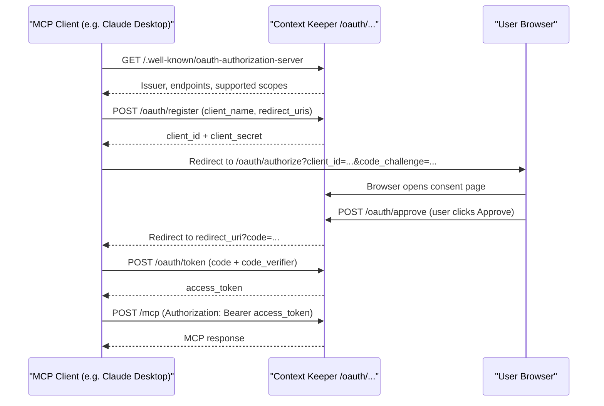

# Authorization

Context Keeper's HTTP transport supports three authentication modes. Choose the one that matches your deployment scenario.


| Mode                     | Env vars                       | Use when                                             |
| ------------------------ | ------------------------------ | ---------------------------------------------------- |
| **Insecure (dev)**       | `MCP_ALLOW_INSECURE_HTTP=true` | Local development on loopback only                   |
| **Static bearer tokens** | `MCP_AUTH_TOKENS`              | Self-hosted, scripted access, multi-tenant isolation |
| **OAuth 2.1**            | `MCP_OAUTH_ISSUER`             | Production, Claude Desktop, standard OAuth clients   |


:::note
Authorization only applies to HTTP transport. stdio transport (the default) runs as a local process and has no network authentication surface.
:::

---

## Mode 1 — Insecure dev mode

```bash
MCP_ALLOW_INSECURE_HTTP=true MCP_TRANSPORT=http cargo run -p context-keeper-mcp
# or simply:
make dev
```

The server starts without any authentication. Connections are restricted to loopback addresses (`127.0.0.1` / `::1`) by the server itself — binding to `0.0.0.0` with this mode enabled will be rejected at startup.

This is the correct mode for:

- `make dev` / `make dev-seed` local testing
- Running the TUI (`make tui`) against a local dev server
- Integration test environments where the caller is always local

:::danger
Never use insecure mode in production or expose the port externally, even via a tunnel.
:::

---

## Mode 2 — Static bearer tokens

Set one or more tokens (comma-separated). Clients must send the token in every request.

```bash
MCP_AUTH_TOKENS=my-secret-token MCP_TRANSPORT=http cargo run -p context-keeper-mcp
```

**Client-side** — add the header to every request:

```
Authorization: Bearer my-secret-token
```

### Multi-tenancy with MCP_TENANT_MAP

Each token can be mapped to an isolated tenant database. Tenants get their own SurrealDB namespace, so data from one token is never visible to another.

```bash
MCP_AUTH_TOKENS=token-alice,token-bob \
MCP_TENANT_MAP=token-alice:alice,token-bob:bob \
MCP_TRANSPORT=http \
cargo run -p context-keeper-mcp
```

Tokens without a tenant suffix default to the shared `default` tenant.

**Configuring the TUI for bearer auth:**

```bash
CK_MCP_URL=http://localhost:3000/mcp \
CK_MCP_TOKEN=my-secret-token \
cargo run -p context-keeper-tui --features remote-mcp
```

---

## Mode 3 — OAuth 2.1

OAuth 2.1 is the recommended mode for production deployments and is required for Claude Desktop's remote MCP integration. The server implements the full [MCP Authorization spec](https://spec.modelcontextprotocol.io/specification/2025-03-26/basic/authorization/) with PKCE and dynamic client registration.

### Setup

```bash
MCP_OAUTH_ISSUER=https://mcp.yourdomain.com \
MCP_TRANSPORT=http \
MCP_HTTP_HOST=0.0.0.0 \
cargo run -p context-keeper-mcp
```

`MCP_OAUTH_ISSUER` must be the public HTTPS base URL of the server. This value is published in the discovery documents and validated by clients.

Optionally, restrict who can register new OAuth clients:

```bash
MCP_OAUTH_REGISTRATION_TOKEN=registrar-secret
```

When set, the `/oauth/register` endpoint requires `Authorization: Bearer registrar-secret`. Omitting it allows open (public) registration — only appropriate for trusted networks.

### Authorization flow




### Discovery endpoints

Once running, the server exposes standard OAuth 2.1 metadata:


| Endpoint                                      | Purpose                                |
| --------------------------------------------- | -------------------------------------- |
| `GET /.well-known/oauth-authorization-server` | Authorization server metadata          |
| `GET /.well-known/oauth-protected-resource`   | Protected resource metadata            |
| `POST /oauth/register`                        | Dynamic client registration (RFC 7591) |
| `GET /oauth/authorize`                        | Authorization endpoint (PKCE required) |
| `POST /oauth/approve`                         | User consent approval                  |
| `POST /oauth/token`                           | Token endpoint                         |


### Coexistence with static tokens

When `MCP_OAUTH_ISSUER` is set, static tokens in `MCP_AUTH_TOKENS` are still accepted alongside OAuth tokens. This is useful for:

- CI/CD pipelines that use a static token while human users go through OAuth
- Migration: existing static-token integrations keep working while OAuth is being rolled out

### Claude Desktop configuration

```json
{
  "mcpServers": {
    "context-keeper": {
      "url": "https://mcp.yourdomain.com/mcp"
    }
  }
}
```

Claude Desktop discovers the OAuth endpoints automatically via the `/.well-known/` metadata and initiates the browser-based consent flow on first connection.

---

## Security checklist

- Never use `MCP_ALLOW_INSECURE_HTTP` on a port exposed outside localhost
- Rotate `MCP_AUTH_TOKENS` values if a token is compromised; old tokens are rejected immediately on restart
- Use `MCP_REQUIRE_AUTH_FOR_WAN=true` (the default) — binding to `0.0.0.0` without auth causes a startup error
- Place a TLS-terminating reverse proxy (Caddy, nginx) in front for HTTPS; Context Keeper does not terminate TLS itself
- Set `MCP_OAUTH_REGISTRATION_TOKEN` in production to prevent arbitrary clients from registering
- Use `MCP_TENANT_MAP` to isolate data when multiple users or agents share one server

---

## Related

- [Using HTTP Transport](./http-transport) — starting the server, multi-agent architecture
- [Running with Docker](./running-with-docker) — containerized HTTP deployment

