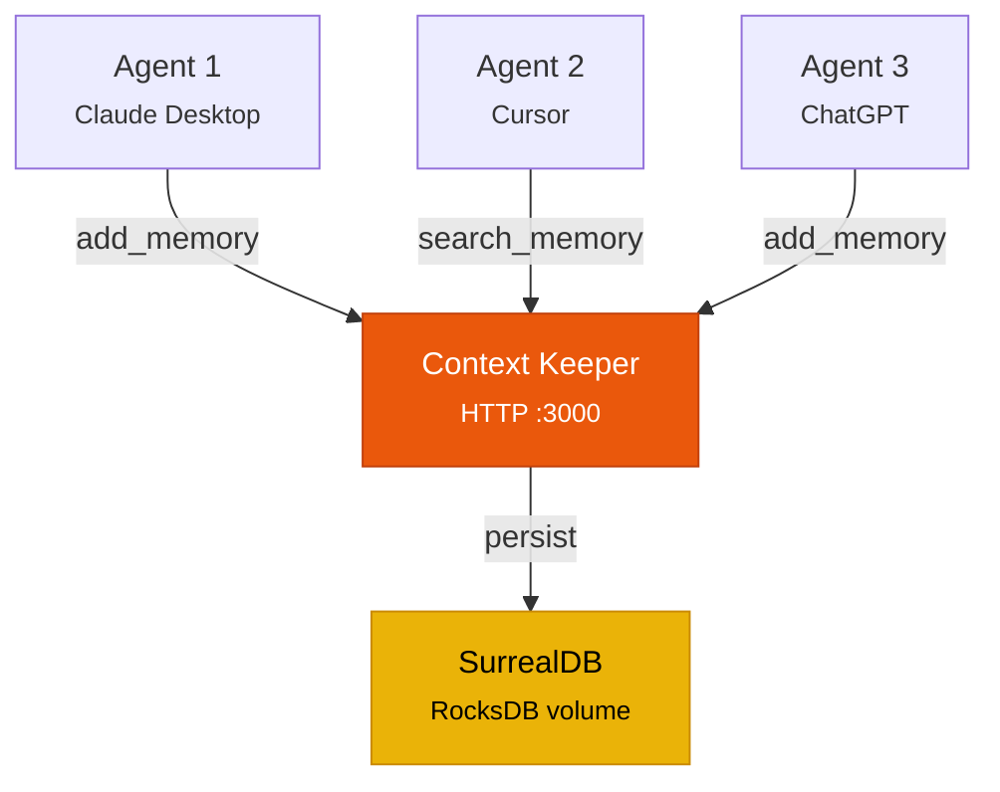

# Using HTTP Transport

By default, Context Keeper uses stdio transport — the server reads from stdin and writes to stdout. HTTP transport turns it into a network-accessible server that multiple agents can share.

## When to use HTTP

| Scenario | Transport |
|----------|-----------|
| Single user, local client (Claude Desktop, Cursor, Claude Code) | stdio |
| Multiple agents sharing one knowledge graph | **HTTP** |
| Docker or containerized deployment | **HTTP** |
| ChatGPT or clients that require HTTP | **HTTP** |
| Remote server accessed over the network | **HTTP** |
| CI/CD pipeline integration | **HTTP** |

## Starting the HTTP server

### From binary

```bash
MCP_TRANSPORT=http MCP_HTTP_PORT=3000 context-keeper-mcp
```

### From source

```bash
MCP_TRANSPORT=http MCP_HTTP_PORT=3000 cargo run --release -p context-keeper-mcp
```

### With Docker

```bash
docker compose up --build
```

The Docker setup uses HTTP transport by default. See [Running with Docker](/docs/tutorials/running-with-docker).

The server will start and listen on the configured port:

```
Context Keeper MCP server starting...
Transport: HTTP
Listening on: 0.0.0.0:3000
```

## Multi-agent architecture

HTTP transport enables multiple AI agents to read from and write to the same knowledge graph:



Each agent identifies itself via the `agent_id` parameter in tool calls. This enables:

- **Shared knowledge**: Agent 1 stores a memory, Agent 2 retrieves it
- **Agent attribution**: `list_agents` shows which agents contributed what
- **Namespace isolation**: Different agents can use different namespaces for scoped memory
- **Cross-namespace search**: `cross_namespace_search` queries across all namespaces

### Example: Two agents sharing memory

**Agent 1 stores context:**
```json
{
  "tool": "add_memory",
  "params": {
    "text": "The deployment pipeline takes 12 minutes on average",
    "source": "infrastructure-review",
    "agent_id": "devops-agent",
    "namespace": "infra"
  }
}
```

**Agent 2 recalls it:**
```json
{
  "tool": "search_memory",
  "params": {
    "query": "How long does deployment take?",
    "namespace": "infra"
  }
}
```

## Client configuration for HTTP

### Claude Desktop

```json
{
  "mcpServers": {
    "context-keeper": {
      "url": "http://localhost:3000/mcp"
    }
  }
}
```

### ChatGPT

Add `http://localhost:3000/mcp` as an MCP server endpoint in the ChatGPT MCP settings.

### Programmatic access (curl)

```bash
# Add a memory
curl -X POST http://localhost:3000/mcp \
  -H "Content-Type: application/json" \
  -d '{
    "jsonrpc": "2.0",
    "method": "tools/call",
    "params": {
      "name": "add_memory",
      "arguments": {
        "text": "Alice leads the platform team",
        "source": "org-chart"
      }
    },
    "id": 1
  }'

# Search
curl -X POST http://localhost:3000/mcp \
  -H "Content-Type: application/json" \
  -d '{
    "jsonrpc": "2.0",
    "method": "tools/call",
    "params": {
      "name": "search_memory",
      "arguments": {
        "query": "Who leads the platform team?"
      }
    },
    "id": 2
  }'
```

## Security

For a full overview of authentication modes — static bearer tokens, OAuth 2.1, multi-tenancy, and the security checklist — see the dedicated [Authorization guide](./authorization).

### Quick reference

Set bearer tokens via the `MCP_AUTH_TOKENS` environment variable:

```bash
MCP_AUTH_TOKENS=token1,token2 MCP_TRANSPORT=http context-keeper-mcp
```

Clients must include the token in requests:

```
Authorization: Bearer token1
```

For production deployments with Claude Desktop or standard OAuth clients, use OAuth 2.1 by setting `MCP_OAUTH_ISSUER`. See [Authorization → OAuth 2.1](./authorization#mode-3--oauth-21).

:::caution
Without `MCP_AUTH_TOKENS` or `MCP_OAUTH_ISSUER`, the server requires `MCP_ALLOW_INSECURE_HTTP=true` to start. Never run without auth in production.
:::

### TLS / HTTPS

Context Keeper doesn't terminate TLS directly. Use a reverse proxy:

**Caddy** (automatic HTTPS):
```
memory.yourdomain.com {
    reverse_proxy localhost:3000
}
```

**nginx**:
```nginx
server {
    listen 443 ssl;
    server_name memory.yourdomain.com;

    ssl_certificate /path/to/cert.pem;
    ssl_certificate_key /path/to/key.pem;

    location / {
        proxy_pass http://localhost:3000;
        proxy_set_header Host $host;
    }
}
```

### Network isolation

For local-only access, bind to localhost:

```bash
MCP_HTTP_HOST=127.0.0.1 MCP_TRANSPORT=http context-keeper-mcp
```

## Troubleshooting

### Port already in use

```bash
# Find what's using port 3000
lsof -i :3000

# Use a different port
MCP_HTTP_PORT=3001 MCP_TRANSPORT=http context-keeper-mcp
```

### Connection refused

1. Verify the server is running: `curl http://localhost:3000/mcp`
2. Check if the server is binding to the right interface (`0.0.0.0` vs `127.0.0.1`)
3. Check firewall rules

### Authentication errors

1. Verify `MCP_AUTH_TOKENS` is set on the server
2. Check the client is sending the `Authorization: Bearer <token>` header
3. Ensure the token matches one of the comma-separated values in `MCP_AUTH_TOKENS`

---

## Next steps

- [Authorization](/docs/tutorials/authorization) — Bearer tokens, OAuth 2.1, multi-tenancy, security checklist
- [Running with Docker](/docs/tutorials/running-with-docker) — Containerized HTTP deployment
- [MCP Server Setup](/docs/tutorials/mcp-server-setup) — Connect your AI client
- [MCP Tools Reference](/docs/mcp-tools) — Full tool documentation
